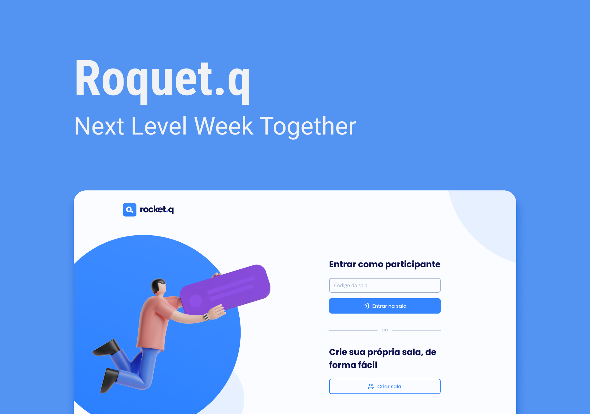

<h1 align="center"> Rocket.Q 💭</h1>

A website of rooms where you can make anonymous questions for one person.

  <a href="#-technologies">Technologies</a>&nbsp;&nbsp;&nbsp;|&nbsp;&nbsp;&nbsp;
  <a href="#-project">Project</a>&nbsp;&nbsp;&nbsp;|&nbsp;&nbsp;&nbsp;
  <a href="#-layout">Layout</a>&nbsp;&nbsp;&nbsp;|&nbsp;&nbsp;&nbsp;

 

  

## 🚀 Technologies

This project were developed with the following technologies:

- HTML
- CSS
- EJS
- NodeJS
- JavaScript
- Git and Github

## 💻 Project

Rocket.Q it's a website that anyone can access to create rooms. Every room has an ID and a password, and when the ID is shared with other people, they can do anonymous questions for you. Only the rooms's creator has priviles, so only he can answer or delete it. There's no limit of rooms or questions!

## 🔖 Layout

You can see the design at Figma with [this link](https://www.figma.com/design/ys1sucOueoj5d6f1Cz24tB/Roquet.q-(Community)). You'll need an account on [Figma](https://figma.com) to access it.

---

Thank you for reading! 💕
